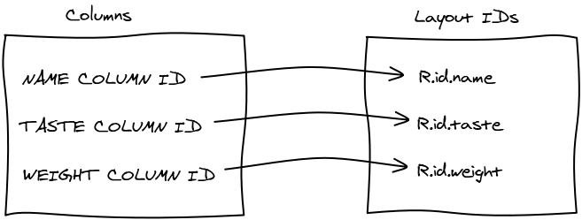
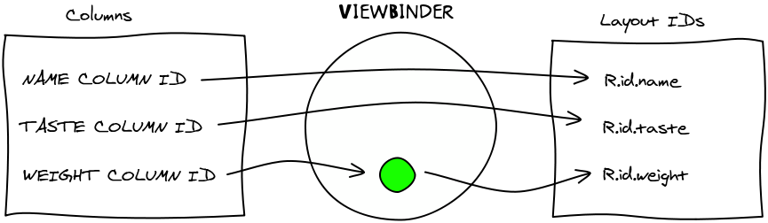

# SQLite Data Binding

Slides By: [Amit Kotlovski](http://amitkotlovski.com)

# The Problem

* We have a Database holding all our data
* We can get a _Cursor_ with the data we want to display
* We want to display the data in a _ListView_

# A Possible Solution

* Create an _ArrayList_
* Iterate over the _Cursor_ and add its contents to the _ArrayList_
* Use an _ArrayAdapter_ to connect to the _ListView_

# Issues with the Solution
## Complication

* We need to create a temporary collection each time
* We need to iterate all the items in the _Cursor_

# Issues with the Solution
## Efficiency / Performance

* For a very big _Cursor_ will take a lot of time iterate it
* Even if the user only looks at the first few items

# Issues with the Solution
## Limiting

* Hard to display a complex _View_ for each item

# A Better Solution

An _Adapter_ for _Cursor_s 

# Enter _SimpleCursorAdapter_
## An _Adapter_ that wraps a _Cursor_

# _SimpleCursorAdapter_

Connects columns in the Cursor data to _TextView_s and _ImageView_s in a Layout

# _SimpleCursorAdapter_
## Syntax

<pre><code class="java small">
// FROM
String[] cols = new String[] { NAME_COL_NAME, DESCRIPTION_COL_NAME };

// TO
int[] ids = new int[] { R.id.name_txt, R.id.desc_txt};

SimpleCursorAdapter adapter =
        new SimpleCursorAdapter(this,               // Context
                                R.layout.item,      // Item layout
                                cursor,             // Results cursor
                                cols,               // Columns
                                ids,                // Views
                                0);                 // Special flags
</code></pre>

# But What If We Need More?

* Column data that requires processing before display
* Data that does not fit neither a _TextView_ nor _ImageView_

# Meet the _ViewBinder_

* Allow basic columns → id mapping
* Enable manual override for some mappings

# _ViewBinder_

* Allows customizing the translation of Cursor data by handling specific
  columns' data presentations

# Answers and Questions

# Thanks!
##Just thought of a new question?

courses@amitkotlovski.com
